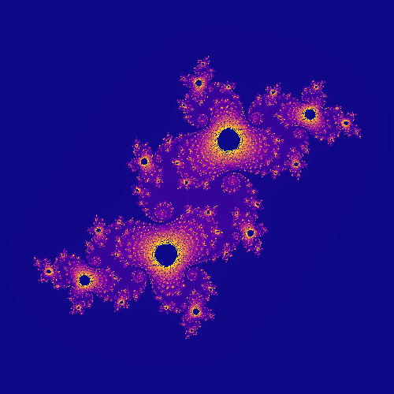
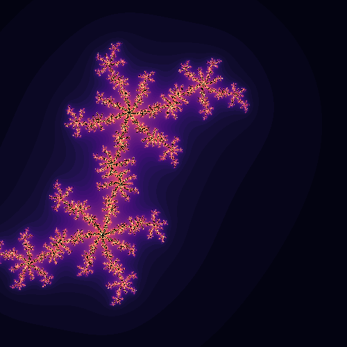
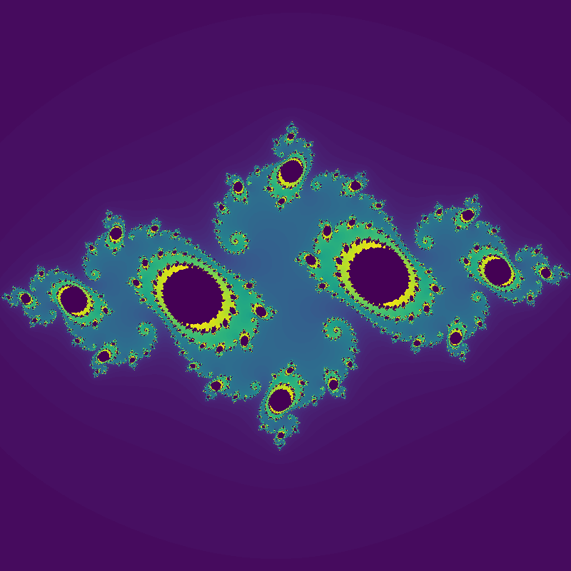
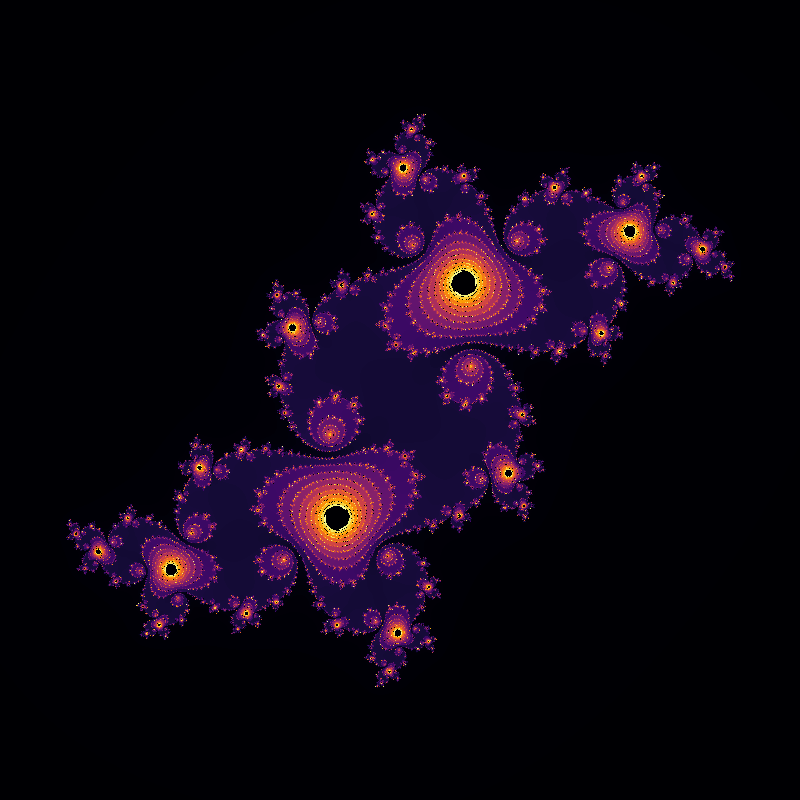

# julia
Generative Julia Set Image in Go

[](https://github.com/jdxyw/julia/actions/workflows/go.yml)
[](https://goreportcard.com/report/github.com/jdxyw/julia)
[](https://raw.githubusercontent.com/jdxyw/julia/master/LICENSE)

In general terms, a `Julia set` is the boundary between points in the complex number plane or the Riemann sphere (the complex number plane plus the point at infinity) that diverge to infinity and those that remain finite under repeated iteration of some mapping (function). The most famous example is the Mandelbrot set.

For us, we don't need to care about those math theory behind us. We are interested in the complex structure and the wonderful shape that it presents. Actually, it's also called generative art. How to color a julia set is also a interesting field.

This package provides simple interface to define a `Julia set` with customize functuon, color map and save it to local with different format.

## Install

```bash
go get github.com/jdxyw/julia
```

## Colormap

A carefully chosen color map could make the image more attractive. In this version, the package provides some predefined color map. These color maps have the some name with those named color map in `matplotlib`.

## Usage and example

### Example 1
In this example, we generative a `Julia Set` with $z=z^{2}+C$ and `Plasma` color map, $C=-0.1+0.65i$.

```go
package main

import (
	"github.com/jdxyw/julia"
)

func julia1(z complex128) complex128 {
	c := complex(-0.1, 0.65)

	z = z*z + c

	return z
}

func main() {
	j := julia.NewJulia(800, 800, 1.5, 1.5, 1000, 10, julia1)
	j.Generative(julia.Plasma)
	j.ToPng("julia.png")
}
```



### Example 2
In this example, we generative a `Julia Set` with $z=z^{3}+C$ and `Magma` color map, , $C=-0.1+0.65i$

```go
package main

import (
	"github.com/jdxyw/julia"
)

func julia1(z complex128) complex128 {
	c := complex(-0.1, 0.65)

	z = z*z+z  + c

	return z
}

func main() {
	j := julia.NewJulia(500, 500, 1.5, 1.5, 60, 10, julia1)
	j.Generative(julia.Magma)
	j.ToPng("julia.png")
}
```



### Example 3
In this example, we generative a `Julia Set` with $z=z^{2}+C$ and `Viridis` color map, , $C=-0.75+0.11i$

```go
package main

import (
	"github.com/jdxyw/julia"
)

func julia1(z complex128) complex128 {
	c := complex(-0.75, 0.11)

	z = z*z + c

	return z
}

func main() {
	j := julia.NewJulia(800, 800, 1.5, 1.5, 100, 50, julia1)
	j.Generative(julia.Viridis)
	j.ToPng("julia3.png")
}

```


### Example 4
In this example, we generative a `Julia Set` with $z=z^{2}+C$ and `Inferno` color map, , $C=-0.1+0.65i$

```go
package main

import (
	"github.com/jdxyw/julia"
)

func julia1(z complex128) complex128 {
	c := complex(-0.1, 0.651)

	z = z*z + c

	return z
}

func main() {
	j := julia.NewJulia(800, 800, 1.5, 1.5, 800, 40, julia1)
	j.Generative(julia.Inferno)
	j.ToPng("julia4.png")
}
```
